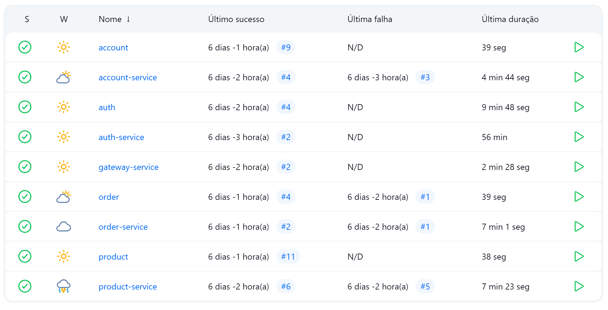

# Jenkins

Como eu havia mencionado no Product e no Order, o Jenkins foi utilizado para o desenvolvimento de um pipeline completo de CI/CD para automotização do deploy de uma aplicação em nuvem.

A pipeline desenvolvida incluí as seguintes etapas:

1. SCM
2. Dependencies
3. Build
4. Push to Docker Hub
5. Deploy to K8s

## APIs no Jenkins

## Estrutura

Ela fica localizada na pasta dos microsserviços :

.
├── account-service
│   ├── Jenkinsfile
│   └── ...

## Implementação

### Jenkinsfile para Interface

=== "Account" { .java .copy .select linenums="1" } --8<-- "https://raw.githubusercontent.com/ninasavoy/insper.store.account/main/Jenkinsfile"

=== "Auth" { .java .copy .select linenums="1" } --8<-- "https://raw.githubusercontent.com/ninasavoy/insper.store.auth/main/Jenkinsfile"

=== "Product" { .java .copy .select linenums="1" } --8<-- "https://raw.githubusercontent.com/ninasavoy/product/main/Jenkinsfile"

=== "Order" { .java .copy .select linenums="1" } --8<-- "https://raw.githubusercontent.com/ninasavoy/order/main/Jenkinsfile"    

### Jenkinsfile para Implementação

=== "Account Service" { .groovy .copy .select linenums="1" } --8<-- "https://raw.githubusercontent.com/ninasavoy/insper.store.account-service/main/Jenkinsfile"

=== "Auth Service" { .groovy .copy .select linenums="1" } --8<-- "https://raw.githubusercontent.com/ninasavoy/insper.store.auth-service/main/Jenkinsfile"

=== "Gateway Service" { .groovy .copy .select linenums="1" } --8<-- "https://raw.githubusercontent.com/ninasavoy/insper.store.gateway-service/main/Jenkinsfile"

=== "Product Service" { .groovy .copy .select linenums="1" } --8<-- "https://raw.githubusercontent.com/ninasavoy/product-service/main/Jenkinsfile"

=== "Order Service" { .groovy .copy .select linenums="1" } --8<-- "https://raw.githubusercontent.com/ninasavoy/order-service/main/Jenkinsfile"