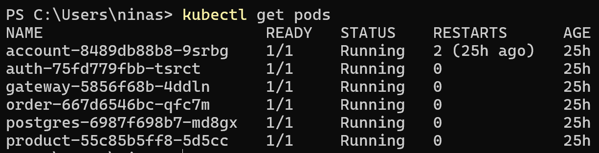

# MiniKube

O MiniKube foi escolhido como orquestrador Kubernets para a arquitetura de microsserviços desenvolvida.

## APIs no Jenkins


## Estrutura

Ela fica localizada na pasta dos microsserviços:

.
├── account-service
│   ├── k8s/
│   │   ├── k8s.yaml 
│   └── ...

## Código Fonte

Os arquivos de configuração do MiniKube são apenas criados nos repositórios de implementação da API, ou seja, aqueles que possuem ´Service´ no nome.

### Postgres

=== "Postgres"
    ``` { .yaml .copy .select linenums="1" }
    --8<-- "https://raw.githubusercontent.com/ninasavoy/insper.store.account-service/main/k8s/postgres.yaml"
    ```

### Account Service

=== "Deployment"
    ``` { .yaml .copy .select linenums="1" }
    --8<-- "https://raw.githubusercontent.com/ninasavoy/insper.store.account-service/main/k8s/deployment.yaml"
    ```

=== "Service"
    ``` { .yaml .copy .select linenums="1" }
    --8<-- "https://raw.githubusercontent.com/ninasavoy/insper.store.account-service/main/k8s/service.yaml"
    ```

### Auth Service

=== "Deployment"
    ``` { .yaml .copy .select linenums="1" }
    --8<-- "https://raw.githubusercontent.com/ninasavoy/insper.store.auth-service/main/k8s/deployment.yaml"
    ```

=== "Service"
    ``` { .yaml .copy .select linenums="1" }
    --8<-- "https://raw.githubusercontent.com/ninasavoy/insper.store.auth-service/main/k8s/service.yaml"
    ```

=== "Secret"
    ``` { .yaml .copy .select linenums="1" }
    --8<-- "https://raw.githubusercontent.com/ninasavoy/insper.store.auth-service/main/k8s/secret.yaml"
    ```

### Gateway Service

=== "Deployment"
    ``` { .yaml .copy .select linenums="1" }
    --8<-- "https://raw.githubusercontent.com/ninasavoy/insper.store.gateway-service/main/k8s/deployment.yaml"
    ```

=== "Service"
    ``` { .yaml .copy .select linenums="1" }
    --8<-- "https://raw.githubusercontent.com/ninasavoy/insper.store.gateway-service/main/k8s/service.yaml"
    ```

### Product Service

=== "Deployment"
    ``` { .yaml .copy .select linenums="1" }
    --8<-- "https://raw.githubusercontent.com/ninasavoy/product-service/main/k8s/deployment.yaml"
    ```

=== "Service"
    ``` { .yaml .copy .select linenums="1" }
    --8<-- "https://raw.githubusercontent.com/ninasavoy/product-service/main/k8s/service.yaml"
    ```

### Order Service

=== "Deployment"
    ``` { .yaml .copy .select linenums="1" }
    --8<-- "https://raw.githubusercontent.com/ninasavoy/order-service/main/k8s/deployment.yaml"
    ```

=== "Service"
    ``` { .yaml .copy .select linenums="1" }
    --8<-- "https://raw.githubusercontent.com/ninasavoy/order-service/main/k8s/service.yaml"
    ```

